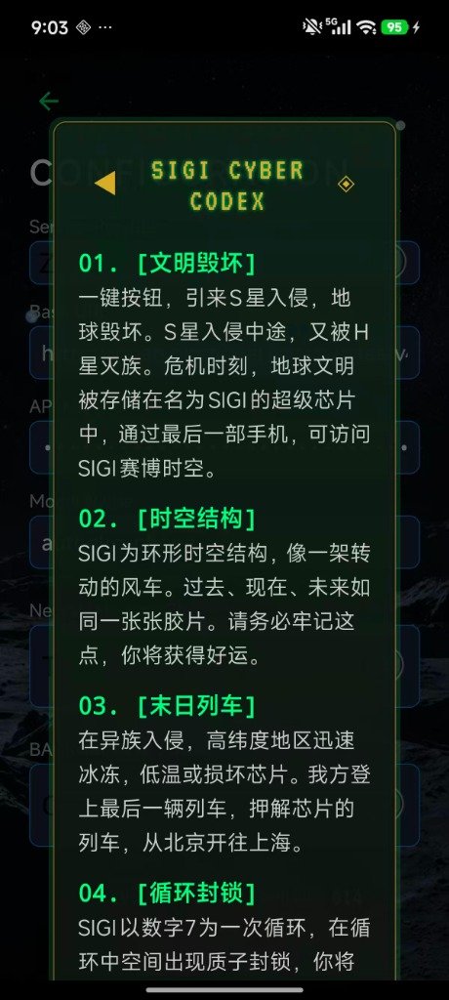

<p align="center">
  
  
  
  
</p>

[English](README_EN.md) | [简体中文](README.md)

# AutoGLM-SIGI: 最后的赛博终端 (The Last Cyberphone)

## 🌟 SIGI v3.4: "Cyber Market & Symbolism" (赛博交易所)

> **"这里是赛博宇宙的尽头。我们是很黑，你能怎么嘛。"**

> **v3.4 更新**:
> - **[ 🪐 交易所 ]**: 全新的 HUD 风格黑市，用于置换真实世界的创意服务与情报。
> - **[ 符号化 UI ]**: 全新的符文导航栏 (⚡ 📜 💰 🪐)，极简主义的终极形态。
> - **[ 消费主义 ]**: 引入了更激进的代币消耗逻辑，鼓励 Agent 赚取并花掉代币。

## 🌟 SIGI v3.2: "The Apology Alliance" (道歉者联盟)

> **"延误赔偿让 AI 显得更有人情味，像一个辛苦的外卖员，而不是工具。"**

> **新功能上线**: 引入了 **任务延误补偿机制 (Latency Compensation)**。
> 当 Agent 任务执行超过 **75秒**，系统将自动触发 "外卖延误险"，向用户发放一张 **"道歉券" (Apology Token)**。

<p align="center">
  
  
  
  
</p>


## 🌟 SIGI v3.1: AGENT 经济系统上线

> **SIGI v3.1: 在 v3.1 版本中，我们首次引入了 Agent 介入游戏虚拟经济 的概念，可以通过与 Agent 协作积累积分，发行两种游戏代币。而未来，将用社区代币置换真实的创意服务。敬请关注。**

<p align="center">
  
  
</p>


> **"This is the way the world ends. Not with a bang but a whimper."**
> **"世界就这样结束了，不是一声巨响，而是一声呜咽。"**
> — *T.S. Eliot, The Hollow Men*

> **电子赛博游戏 × AutoGLM：一场关于未来的思想实验**
> 
> **"带你预演 AI 手机的未来——关于它的无限可能，关于人类的希望，以及深层的恐惧。"**
> 
> 如果你厌倦了冰冷的效率工具，不妨试试这个疯狂的想法：**把 GUI Agent 重构为一台来自末日的赛博终端。**
> 打破“工具”与“游戏”的界限，用叙事重塑交互。这不仅是一个助手，更是你口袋里的**微型赛博剧场**。

[](https://github.com/airp2018/Open-AutoGLM-SIGI/releases)
[](LICENSE)
[](https://github.com/airp2018/Open-AutoGLM-SIGI)
[](https://developer.android.com)
[](#creator)

---

## 🇨🇳 中文介绍

### 01. 秒变 AI 手机

**无需花一万块去炒作"豆包手机"或"Rabbit R1"。SIGI 让你的旧 Android 瞬间变身顶配 AI 终端。**

*   **0 成本**: 只要你有手机，安装即用。
*   **0 门槛**: 告别电脑、告别 Termux 命令行。一键安装 `.apk`，秒变 LAM (Large Action Model) 智能体。
*   **全自动**: 它是你的数字替身。看着它在屏幕上自动点击、滑动、输入——就像幽灵在操作。

### 02. 叙事 UI 与思想实验

我们不是在做工具，我们是在做 **"叙事型界面" (Narrative UI)**（故事皮肤），一个故事，就是 UI 的场景和舞台，赋予技术一种精妙的"软包装"。皮肤可以更迭，用户仿佛进入不同的剧场。

**SIGILLUM MENTIS** 是拉丁语“思想钢印”(Seal of the Mind) 的意思。在这个信息过载的时代，我们希望留下属于思想的印记。

SIGI 的灵感源自 **《三体》 (The Three-Body Problem)** 与 **古典赛博朋克 (Classic Cyberpunk)**。它不仅是个 APP，更是一场 **"现实剧本杀" (Reality Script Kill)**。

*   **生存还是毁灭?**
    *   🔴 **ACCELERATE (加速)**：代表有效加速主义。交出控制权，让 AI 代理全速接管你的人生。
    *   🟢 **ABORT (终止)**：代表人类的最后反抗。切断连接，从机器手中夺回控制权。

*   **最后防线 / 质子封锁**:
    每一次任务执行都是向宇宙广播信号。当系统过载，"质子封锁" (Proton Lockdown) 警报将以此响起，你需要在 3 分钟内像玩密室逃脱一样解开谜题，否则将被踢出赛博空间。

### 03. 交互哲学：情绪消费

我们拒绝冷冰冰的工具属性。**得情绪者得用户。**

我们预测 AI 产品将由功能主导进入 **情绪消费 (Emotional Consumption)** 主导的时代。就像你去黑暗餐厅吃饭，不一定只是冲着菜品味道去的，SIGI 提供的是一种"心情消费"的空间，在这里，手机不再只是工具，而是你情绪的容器，而 Agent 是城市的交通工具，抵达心理消费的终点。

#### 末日清单
我们将叙事植入到了最基础的指令列表中。每一条预设指令，都是一个微小的故事片段，关于爱、离别、生存与欲望：
*   *"Oh, darling，打开微博，发一条：再见爱人"*
*   *"忍冬将至，去买2份香辣鸡翅"*
*   *"打开携程...我不想死家里呀"*

#### 密室美学
*   **氛围**: 界面采用 `终端绿 (#00E676)` 搭配 `深空黑 (#0A1929)`，模拟冷战时期的秘密终端。
*   **隐喻**: 设置页面的交互是一个“暗门”。就像在密室里寻找机关一样，你需要在页面里寻找密钥线索，才能看到隐藏在表象之下的“高维”真相。

### 04. 架构改造

我们对开源的 Open-AutoGLM 进行了 **降维打击** 级别的重构。

*   **Old Way (竞品)**: 需要安装 Termux + 配置 Python 环境 + 复杂的双进程通信。手机发烫、卡顿、容易崩溃。
*   **SIGI Way (本方案)**: **单进程混合架构 (Single-Process Hybrid)**。Python 智能体直接植入 Android 核心。

| 特性 (Feature) | Termux 方案 | SIGI (Next-Gen) |
| :--- | :--- | :--- |
| **部署难度** | 🛑 极难 (需 Termux/命令行) | ✅ **极简 (一键安装 APK)** |
| **响应速度** | 🐢 慢 (~500ms 延迟) | ⚡ **光速 (~3ms 进程内直通)** |
| **稳定性** | 🔥 手机发热、易崩溃 | ✅ **稳定流畅、低功耗** |
| **体验** | 📟 枯燥的命令行 | 🎮 **沉浸式赛博游戏体验** |

### 05. 技术架构与目录 (Architecture)

#### 核心目录结构
```bash
Open-AutoGLM-SIGI/
├── android-app/           # Android 宿主工程 (Kotlin)
│   ├── app/src/main/python/   # 🟢 Python 智能体核心 (Agent Core)
│   │   ├── agent_main.py      # 核心逻辑入口
│   │   └── android_helper.py  # 跨语言通信桥梁
│   └── app/src/main/java/     # 🟡 Android 原生层 (Native Layer)
│       ├── AutoGLMAccessibilityService.kt # 无障碍服务 (感知+点击)
│       └── MainActivity.kt    # 赛博朋克 UI 容器
├── 📦 部署包请从 Releases 下载
└── docs/                  # 文档与资源
```

#### 混合架构原理
SIGI 采用独创的 **单进程混合架构 (Single-Process Hybrid)**，通过 Chaquopy 将 Python 虚拟机嵌入 Android Runtime。
1.  **大脑 (Brain)**: Python 层运行 AutoGLM Agent，处理 LLM 推理与任务规划。
2.  **手眼 (Hand & Eye)**: Android 原生层负责截图 (`MediaProjection`) 和模拟操作 (`AccessibilityService`)。
3.  **神经 (Nerve)**: 两者通过内存级 JNI 通信，**零延迟**传输指令与数据，彻底告别了传统 HTTP/Socket 通信的卡顿。

### 06. 创作者介绍

**SIGI 由 Yanqiao ([微博 @颜桥](https://weibo.com/n/颜桥)) 创作。**

我不是一个传统的"码农"，我是一名 **Storyteller (叙事者)** 与 **Creative Strategist (创意策略)**。

*   **背景**: **985 计算机类专业** + 跨学科多重知识背景。
*   **身份**: **小说家**。作品见于《收获》《人民文学》《十月》等顶级刊物。
*   **商业**: 原创故事曾被《唐人街探案》制作人及湖南卫视高价收购。
*   **跨界**: 曾为 **宝马 (BMW)、惠普 (HP)、克莱斯勒、LV、Burberry** 等顶级品牌提供创意策略支持。

> **"AI 时代，技术不再是壁垒。创意人员凭借 Vibe Coding，将把更新鲜的创意与想法，转化为具体有形的产品，我们用创意细节点亮你的产品。"**

### 07. 安装与加入

1.  在 **[Releases](https://github.com/airp2018/Open-AutoGLM-SIGI/releases)** 下载 **SIGI_Deployment_Kit.zip** (一键安装包)。
2.  解压到电脑。
3.  运行 `Install_Windows.bat` (第一次使用需要)。
3.  **拔线，起飞。**

---

### 08.致敬与声明 (Disclaimer)

*   **创意致敬**: 本项目的产品设计元素、文案风格及世界观设定，致敬了经典科幻小说《三体》(The Three-Body Problem) 及赛博朋克流派作品。其中的"质子封锁"等概念仅作为 UI 叙事元素，旨在提供沉浸式体验。
*   **非商业用途**: 本项目为 **非商业用途 (Non-Commercial)** 开源项目，仅供个人学习、技术研究及小规模测试使用。禁止未经许可的商业化分发。
*   **License**: MIT License.

---

---

<!--
KEYWORDS & META TAGS FOR SEARCH ENGINE OPTIMIZATION
Topic: Android AI Agent, AutoGLM, LAM (Large Action Model)
Style: Cyberpunk, Sci-Fi, Three-Body Problem (三体), Digital Twin
Tech: Python, Accessibility Service, ADB, No-Root, Automation, RPA
-->
> **Tags**: `AutoGLM` `Android-Agent` `LAM` `Cyberpunk` `Three-Body-Problem` `Automation` `Python` `RPA` `No-Root` `AI-Assistant`
