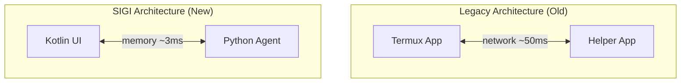

<p align="center">
  
</p>

# AutoGLM-SIGI: 最后的赛博终端 (The Last Cyberphone)
> **一个伪装成手机终端的“现实黑客”装置。**
> **A "Reality Hacking" Device Disguised as a Mobile Terminal.**

[](LICENSE)
[](https://developer.android.com)
[](#philosophy)

---

## 01. 入口 (The Entrance)

**SIGI** (Sigillum Mentis) 不仅仅是一个 AI 助手，它是一场 **“操控现实的剧本杀” (Reality Script Kill)**。

在这个剧本里，你不再是手机的奴隶，而是驾驶员。我们将复杂的数字世界简化为两个物理按钮——就像《黑客帝国》里的红蓝药丸，或者密室逃脱里的最终开关。

*   🔴 **ACCELERATE (加速)**：按下它，名为 **AutoGLM** 的 AI 幽灵将接管你的屏幕。它会像看着乐谱一样阅读你的 APP，以 16 倍于人类的速度执行枯燥的任务。
*   🟢 **ABORT (终止)**：这是你的逃生通道。当 AI 陷入疯狂或你只想夺回控制权时，拍下这个按钮，切断连接，从赛博空间弹射逃生。

> **SIGI** is not just an AI assistant; it is a **"Reality Script Kill"**.
> 
> In this narrative, you are the pilot. We simplify the digital chaos into two physical buttons—like the Red/Blue pill in *The Matrix* or the final switch in an Escape Room.
> 
> *   🔴 **ACCELERATE**: The **AutoGLM** ghost takes the wheel, executing tasks at 16x human speed.
> *   🟢 **ABORT**: Your eject button from Cyberspace.

---

## 02. 架构革命 (Architecture Revolution)

SIGI 并非凭空诞生。它是对传统开源架构（Termux + Python）的一次彻底 **重构与进化**。

我们抛弃了臃肿的 "Termux 外挂" 方案，采用 **Chaquopy** 技术将 Python 智能体直接植入 Android 核心进程，创造了 **单进程混合架构 (Single-Process Hybrid Architecture)**。

> SIGI is a complete evolution from the traditional "Termux" approach. We embedded the Python Agent directly into the Android core via **Chaquopy**, creating a **Single-Process Hybrid Architecture**.



### 核心进化数据 (Evolution Metrics):
*   🚀 **速度 (Speed)**: 通信延迟从 **50ms** 降至 **3ms** (进程内直通)，提升 **16 倍**。
*   💾 **轻量 (Lightweight)**: 内存占用降低 **47%** (150MB -> 80MB)。
*   🛡️ **稳定 (Stability)**: 彻底解决了双进程保活难题，拒绝后台被杀。
*   🔧 **部署 (Deployment)**: 从复杂的 **12 步** 命令行操作缩减为 **3 步** 傻瓜式安装。

---

## 03. 交互哲学：情绪消费 (UI/UX Philosophy)

我们拒绝冷冰冰的工具属性。SIGI 的 UI 设计融合了 **科幻小说、密室游戏与沉浸式戏剧** 的元素。

### 01. 密室美学 (Escape Room Aesthetic)
*   **氛围**: 界面采用 `终端绿 (#00E676)` 搭配 `深空黑 (#0A1929)`，模拟冷战时期的秘密终端。
*   **隐喻**: 设置页面的下拉手势是一个“暗门”。就像在密室里寻找机关一样，只有向下拉动，才能看到隐藏在表象之下的“三体/水滴”真相。

### 02. 生存游戏 (Gamification of Survival)
*   **质子封锁 (Proton Lockdown)**: 当系统检测到高维负载时，会触发红色的“封锁警报”。你需要在 **3分钟** 内完成解谜（输入 `XXXX`），否则将被强制踢出赛博空间。
*   **拯救计数器**: 每一次按下 ABORT，不仅仅是停止程序，更是一次“拯救世界”的演习。系统会记录你拯救人类的次数，作为你作为驾驶员的勋章。

---

## 04. 安装指南 (Installation)

### 用户通道 (一键部署)
> **For Users (Zero-Code Method)**

1.  下载 **SIGI 部署包** (所有依赖已打包，无需配置环境)。
2.  手机开启 **USB 调试**。
3.  运行 `一键安装(双击我).bat`。
4.  拔线，进入赛博空间。

### 开发者通道 (源码编译)
> **For Developers**

```bash
git clone https://github.com/ToTheMoon/Open-AutoGLM-SIGI.git
cd Open-AutoGLM-SIGI/android-app
./gradlew assembleDebug
```

---

## 05. 创作者与哲学 (Creator & Philosophy)

**SIGI** (Sigillum Mentis) 由 **Yanqiao** (颜桥) 创作。

*   **背景**: 985 CS 计算机科班 + 跨学科双学位背景。
*   **身份**: 创意总监，小说家，Vibe Coding 倡导者。
*   **作品**: 原创故事曾被《唐人街探案》剧组、湖南卫视等知名机构收购。

> *"希望用 AI 创意‘点亮’你的生活。"*
>
> *"I hope to 'light up' your life with AI creativity."*

---

*“We are all insects in the gutter, but some of us are looking at the stars.”*
