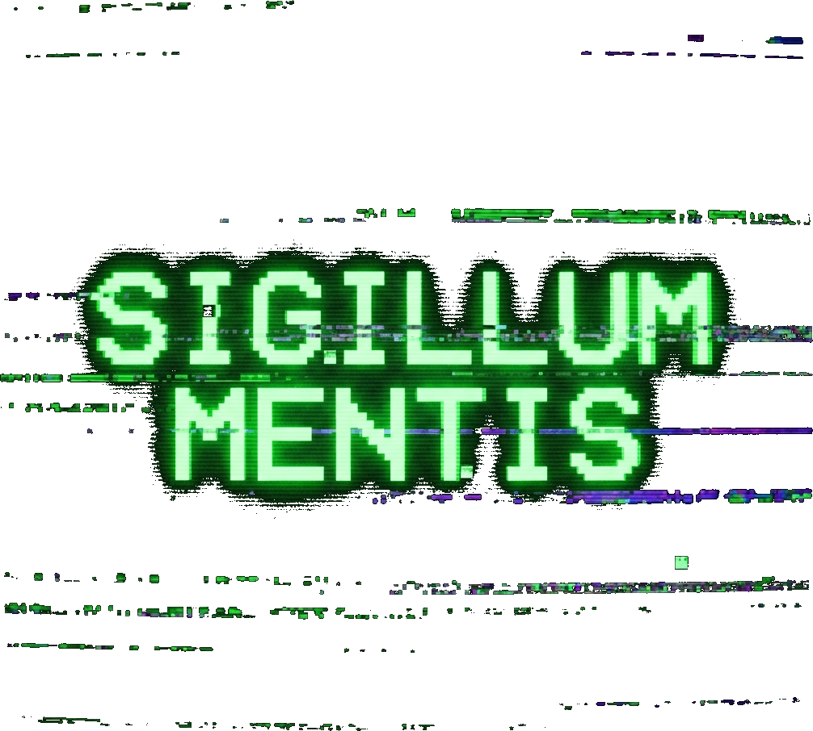

  

# AutoGLM-SIGI: 最后的赛博终端 (The Last Cyberphone)

> **"This is the way the world ends. Not with a bang but a whimper."**
> **"世界就这样结束了，不是一声巨响，而是一声呜咽。"**
> — *T.S. Eliot, The Hollow Men*

---

## 🇨🇳 中文介绍

### 01. 秒变 AI 手机

**无需花一万块去炒作"豆包手机"或"Rabbit R1"。SIGI 让你的旧 Android 瞬间变身顶配 AI 终端。**

*   **0 成本**: 只要你有手机，安装即用。
*   **0 门槛**: 告别电脑、告别 Termux 命令行。一键安装 `.apk`，秒变 LAM (Large Action Model) 智能体。
*   **全自动**: 它是你的数字替身。看着它在屏幕上自动点击、滑动、输入——就像幽灵在操作。

### 02. 叙事 UI 与思想实验

我们不是在做工具，我们是在做 **"叙事型界面" (Narrative UI)**。

**SIGILLUM MENTIS** 是拉丁语“思想钢印”(Seal of the Mind) 的意思。在这个信息过载的时代，我们希望留下属于思想的印记。

SIGI 的灵感源自 **《三体》 (The Three-Body Problem)** 与 **古典赛博朋克 (Classic Cyberpunk)**。它不仅是个 APP，更是一场 **"现实剧本杀" (Reality Script Kill)**。

*   **生存还是毁灭?**
    *   🔴 **ACCELERATE (加速)**：代表有效加速主义。交出控制权，让 AI 代理全速接管你的人生。
    *   🟢 **ABORT (终止)**：代表人类的最后反抗。切断连接，从机器手中夺回控制权。

*   **最后防线 / 质子封锁**:
    每一次任务执行都是向宇宙广播信号。当系统过载，"质子封锁" (Proton Lockdown) 警报将以此响起，你需要在 3 分钟内像玩密室逃脱一样解开谜题，否则将被踢出赛博空间。

### 03. 交互哲学：情绪消费

我们拒绝冷冰冰的工具属性。**得情绪者得用户。**

我们预测 AI 产品将由功能主导进入 **情绪消费 (Emotional Consumption)** 主导的时代。SIGI 提供的是一种"心情消费"的空间——在这里，手机不再只是工具，而是你情绪的容器。

#### 01. 末日清单
我们将叙事植入到了最基础的指令列表中。每一条预设指令，都是一个微小的故事片段，关于爱、离别、生存与欲望：
*   *"Oh, darling，打开微博，发一条：再见爱人"*
*   *"忍冬将至，去买2份香辣鸡翅"*
*   *"打开携程...我不想死家里呀"*

#### 02. 密室美学
*   **氛围**: 界面采用 `终端绿 (#00E676)` 搭配 `深空黑 (#0A1929)`，模拟冷战时期的秘密终端。
*   **隐喻**: 设置页面的交互是一个“暗门”。就像在密室里寻找机关一样，你需要在页面里寻找密钥线索，才能看到隐藏在表象之下的“高维”真相。

### 04. 架构革命

我们对开源的 Open-AutoGLM 进行了 **降维打击** 级别的重构。

*   **Old Way (竞品)**: 需要电脑 + Termux + Python环境 + 复杂的双进程通信。此时你的手机发烫、卡顿、容易崩溃。
*   **SIGI Way (本方案)**: **单进程混合架构 (Single-Process Hybrid)**。Python 智能体直接植入 Android 核心。

| 特性 (Feature) | 传统方案 (Legacy) | SIGI (Next-Gen) |
| :--- | :--- | :--- |
| **部署难度** | 🛑 极难 (需 Termux/命令行) | ✅ **极简 (一键安装 APK)** |
| **响应速度** | 🐢 慢 (~500ms 延迟) | ⚡ **光速 (~3ms 进程内直通)** |
| **无需电脑** | ❌ 必须连接电脑配置 | ✅ **完全脱离电脑运行** |
| **体验** | 📟 枯燥的命令行 | 🎮 **沉浸式赛博游戏体验** |

### 05. 创作者介绍

**SIGI 由 Yanqiao ([微博 @颜桥](https://weibo.com/n/颜桥)) 创作。**

我不是一个传统的"码农"，我是一名 **Storyteller (叙事者)** 与 **Creative Strategist (创意策略)**。

*   **背景**: **985 计算机类专业** + 跨学科多重知识背景。
*   **身份**: **小说家**。作品见于《收获》《人民文学》《十月》等顶级刊物。
*   **商业**: 原创故事曾被《唐人街探案》制作人及湖南卫视高价收购。
*   **跨界**: 曾为 **惠普 (HP)、克莱斯勒、LV、Burberry** 等顶级品牌提供创意策略支持。

> **"AI 时代，技术不再是壁垒。创意人员凭借 Vibe Coding，将把更新鲜的创意与想法，转化为具体有形的产品，我们用创意细节点亮你的产品。"**

### 06. 安装与加入

1.  在 **[Releases](https://github.com/airp2018/Open-AutoGLM-SIGI/releases)** 下载 **SIGI_Deployment_Kit.zip** (一键安装包)。
2.  解压到电脑。
3.  运行 `Install_Windows.bat` (第一次使用需要)。
3.  **拔线，起飞。**

---

## 🇺🇸 English Introduction

### 01. Zero-Cost AI Phone

**Stop paying $10,000 for hyping AI hardware. SIGI transforms your old Android into a top-tier AI terminal instantly.**

*   **Zero Cost**: Free to use if you have an Android phone.
*   **Zero Barrier**: No PC required, no Termux CLI. One-click install `.apk`, instantly becoming a LAM (Large Action Model) agent.
*   **Fully Auto**: It's your digital avatar. Watch it tap, swipe, and type like a ghost on your screen.

### 02. Narrative UI & Thought Experiment

We are not building a tool; we are building a **"Narrative UI"**.

**SIGILLUM MENTIS** is Latin for "Seal of the Mind" (Thought Stamp). In this era of information overload, we aim to imprint the mark of thought.

SIGI is inspired by **"The Three-Body Problem"** and **Classic Cyberpunk aesthetics**. It is not just an app, but a **"Reality Script Kill" (Immersive Mystery Game)**.

*   **Survival or Destruction?**
    *   🔴 **ACCELERATE**: Represents effective accelerationism. Hand over control and let the AI agent take over your life at full speed.
    *   🟢 **ABORT**: Represents humanity's last stand. Cut the connection and reclaim control from the machine.

*   **The Last Line of Defense / Proton Lockdown**:
    Every task execution broadcasts a signal to the universe. When the system overloads, the "Proton Lockdown" alarm will sound, and you will need to solve a puzzle within 3 minutes, like in an escape room, or be kicked out of cyberspace.

### 03. Interaction Philosophy: Emotional Consumption

We reject cold, utilitarian tools. **"He who captures emotions, captures the user."**

We predict that AI products will shift from function-driven to an era dominated by **Emotional Consumption**. SIGI provides a space for "mood consumption"—here, your phone is no longer just a tool, but a vessel for your emotions.

#### 01. The Doomsday Protocols
We embedded narratives into the most basic command list. Each preset command is a micro-story fragment about love, parting, survival, and desire:
*   *"Oh, darling, open Weibo and post: Goodbye, my love"*
*   *"Winter is coming, buy 2 portions of spicy chicken wings"*
*   *"Open Trip.com... I don't want to die at home"*

#### 02. Escape Room Aesthetic
*   **Atmosphere**: The interface uses `Terminal Green (#00E676)` paired with `Deep Space Black (#0A1929)`, simulating a secret terminal from the Cold War era.
*   **Metaphor**: The interaction on the settings page is a "secret door." Just like finding a mechanism in an escape room, you need to find clues for the key within the page to reveal the "Higher Dimensional" truth hidden beneath the surface.

### 04. Architecture Revolution

We refactored the open-source Open-AutoGLM with a **"Dimensional Strike"** level of reconstruction.

*   **Old Way (Competitors)**: Requires a PC + Termux + Python environment + complex dual-process communication. Your phone would overheat, lag, and crash easily.
*   **SIGI Way (This Solution)**: **Single-Process Hybrid Architecture**. The Python agent is directly embedded into the Android core.

| Feature | Legacy Way | SIGI (Next-Gen) |
| :--- | :--- | :--- |
| **Deployment Difficulty** | 🛑 Extremely Hard (Requires Termux/CLI) | ✅ **Extremely Simple (One-click APK install)** |
| **Response Speed** | 🐢 Slow (~500ms latency) | ⚡ **Light Speed (~3ms in-process direct)** |
| **No PC Required** | ❌ Must connect to PC for configuration | ✅ **Runs completely without a PC** |
| **Experience** | 📟 Dry command line | 🎮 **Immersive Cyberpunk gaming experience** |

### 05. The Creator

**SIGI is created by Yanqiao ([Weibo @颜桥](https://weibo.com/n/颜桥)).**

I am not a traditional "coder"; I am a **Storyteller** and **Creative Strategist**.

*   **Background**: **Top-tier CS Degree (985)** + multidisciplinary knowledge background.
*   **Identity**: **Novelist**. Works published in top literary journals such as *Harvest*, *People's Literature*, and *October*.
*   **Commercial**: Original stories were acquired by the producers of *Detective Chinatown* and Hunan Broadcasting System for high value.
*   **Crossover**: Provided creative strategy support for top brands like **HP, Chrysler, LV, and Burberry**.

> **"In the AI era, technology is no longer a barrier. Creative minds, empowered by Vibe Coding, will transform fresh ideas into tangible products. We light up your product with creative details."**

### 06. Install & Join

1.  Download **[SIGI_Deployment_Kit.zip](https://github.com/airp2018/Open-AutoGLM-SIGI/releases)** from Releases.
2.  Unzip it on your PC.
3.  Run `Install_Windows.bat` (First time only).
3.  **Unplug, and Accelerate.**
